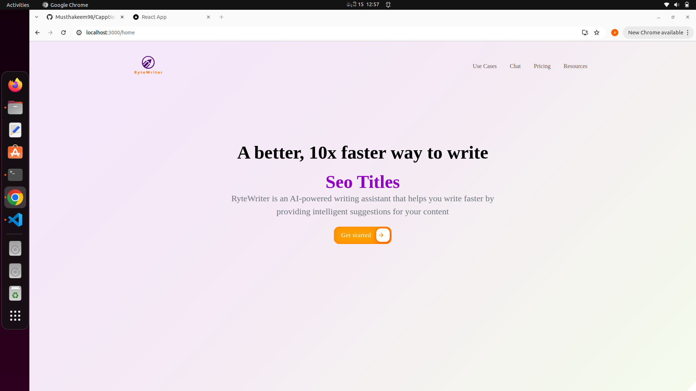

# CaptionBuddyAI


## Screen shot of UI


## Getting Started

1. Install Python 3:

      Go to [install Python 3](https://www.python.org/downloads/)

2. Install Required Python Packages:

    ```
    $ pip3 install -r requirements.txt
    ```

3. Update Env Variables

    ```
    $ cp .env.sample .env
    $ then update `OPENAI_APIKEY` in the .env file
    ```

<hr/>

## Usage
  
  ```
  $ python3 src/main.py
  ```

  ```
  $ curl http://127.0.0.1:8080/
  ```
